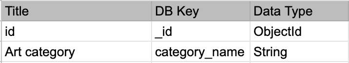

# PROUD UNICORNS

## [The Rainbow Collection](https://hackpride2021.herokuapp.com/)

---

We are a group of coders ([Ana](https://github.com/anabramos), [Iryna](https://github.com/irasan), [Scott](https://github.com/Ryagg[), and [Tim](https://github.com/TravelTimN)) who represent a team called, "Proud Unicorns" in the **#proud-coders hackathon**, organised by **Code Institute** in June 2021. 

We created this awesome collaborative library that shares and celebrates creative production made by, for, and about the LGBTQ+
community. We believe representation is a powerful tool to shaping an artistic scene that is diverse, inclusive, and colourful!

View the [live website](https://hackpride2021.herokuapp.com/) here!

## Wireframes

In order to have some basic structure in place and to be on the same page, we created [wireframes](https://github.com/irasan/hackpride2021/tree/master/static/wireframes) 
and were working from these when creating our project.

   
## **UX**
### **User stories**

1.  User wants to see collections of books, art, movies, music, and podcasts and easily navigate between them.
1.  User wants to save art pieces to a list of favorites and be able to see it later.
1.  User wants to read reviews about art pieces written by other users.
1.  User wants to write reviews about art pieces they saw/heard/read etc.
1.  User wants to contribute to the collections by suggesting new art pieces.

## **Design features**
The following design choices were made in order to implement the game: 

#### **Fonts**
We wanted to use [Gilbert](https://www.typewithpride.com/) colorful font for our headings, but at the moment only black version is available. Instead, we used the black version and added colors manually to each letter in logo.

[Montserrat](https://fonts.google.com/specimen/Montserrat?query=mont) was chosen as our main font for the website because it's 
nicely paired with Gilbert font, is very easy to read, and looks nice on any screen.

#### **Icons**
All icons were chosen for their obvious meaning so that they can be easily understood by everyone. They were implemented 
using [Font Awesome.](https://fontawesome.com/)

#### **Colors**
Color palette for this project resembles LGBTQ flag. Besides a flag picture is used throughout the website as a background.
During implementation, in order to simplify it, all colors were picked from those available on [Materialize](https://materializecss.com/color.html), 
but closely matching the palette.

Design of the website in general is cheerful and bright in order to highlight it's purpose and audience.

## **Technologies Used**

* [HTML](https://www.w3schools.com/html/) or Hypertext markup language. HTML is used to create the structure of web pages. 
It consists of tags which tell the browser how to set out text and images on the page. Hypertext is the method by which you move 
around on the web, markups are the tags which set out the structure of the webpage, thus HTML is a language for web creation with 
its own structure and syntax. The data in the tags is read by the web browser enabling you to create any web page you like. In 
this project my templates are all written in HTML. There is a template for home page, collections of art in each category, individual peices of art together with their reviews. Besides templates for login, registration and user profile were created, as well as 
a separate template for admin users where they can add, approve and edit new art pieces. The base template sets out the way in 
which the website should look (navbar, footer, etc) and information from this is used in each of the other templates.

* [CSS](https://www.w3schools.com/css/) stands for Cascading Style sheets which is a type of style language which sets out how the webpage should be styled. It allows the user to style the webpage in a particular way, making the UX richer and more meaningful for the user.

* [Materialize](https://materializecss.com/) is a CSS framework used for responsive websites. It was used throughout the website for quick and easy styling. In particular, forms and cards that display art pieces were taken from there.

* [JavaScript](https://www.javascript.com/) was used for implementing functions that support some components on the website, like modals, tooltips, navigation, and our beautiful preloader.

* [jquery](https://jquery.com/) is used to simplify DOM manipulation. Jquery is a javascript library that is used to provide interactivity on websites. The $ sign signals to the browser that jquery is being used.

* [Python](https://www.python.org/psf-landing/) is a high level programming language used for apps in many frameworks such as flask, pyramid and django. Python supports many programming paradigms and is object orientated and has a comprehensive set of libraries. 
The version of Python I used in my app is 3.7.

* [Flask](https://flask.palletsprojects.com/en/1.1.x/) is a micro framework used to build web applications. Flask has a small and easily extendable core which gives the developer control over which databases and other third party resources to use when developing an app.

* [Heroku](https://www.heroku.com/) is a cloud platform that allows a developer to build, deliver, scale and monitor apps. Heroku makes the experience of deploying an app relatively straightforward.

* We used [Chrome Developer Tools](https://developers.google.com/web/tools/chrome-devtools/) to work on the code. Chrome dev tools are a set of tools designed to give the developer tools to amend code in a testing environment in order to enhance the UX and functionality experience. We were also able to test the responsiveness of the app using these tools.

* We used [Gitpod](https://www.gitpod.io/) and [VS Code](https://code.visualstudio.com/) as our coding editors. Lots of extensions were available to check the syntax of the code.

## **Information Architecture**
### **Database Choice**
[MongoDB](https://www.mongodb.com/) was chosen for storing data for this project. It's NoSQL document-based database that allows quick and easy search and lots of other fucntionality.

### **Collections Data Structure**
This website relies on 4 different collections that store information about:
- users
- art
- art categories
- reviews

**Users collection**:
For users registration and login, Users collection is used. It also stores information about users saved favorites and reviews as 
well as a boolean regarding their status as admin. Username reference is also added automatically to each review that is being created.

**Art collection**:
Each art piece besides traditional values like title, author, year, country, summary, is_explicit, image, and website, also 
has values for number of reviews, number how many times it was favorited, and a boolean for whether it was approved by admins.
The reason behind this was to avoid creating another collection for art suggestions from users. The code works in the way that each suggested art pieces is stored in the art collection, however it is not displayed on the website until it's approved by admins.

**Reviews collection**:
This collection stores references to art id, users who created the review, and date when it was added.

**Categories collection**:
A list fo all art categories stored in a separate collection in order to do quick calls for display in html templates. 

## **Testing**

We tested each part of our user stories to check it worked as expected.

* The navbar must appear on every page so that the user can easily navigate between pages. Tested and works as expected.

* The navbar has the title of of the website, "The Rainbow Collection" on the left hand side. If a user clicks on this 
they are taken to the Home page. Tested and works as expected.

* The home page shows the following items in the navbar: "The Rainbow Collection", "Home", "Account". The latest shows a 
dropdown list for "Login" and "Register". Tested and works as expected.

* Underneath the main navbar there is a list of art categories. Upon clicking on eah tab, the user is directed to a page
with all art in that category. Tested and works as expected.

* The home page shows the following items in the navbar for logged in users: "The Rainbow Collection", "Make a suggest", 
"Home", "Account". Account tab will show a dropdown menu with "Profile", "Log out", and "Admin" if user is logged in as admin.
Tested and works as expected.

* A logged out user can see all the art in categories and on their individual pages. Tested and works as expected.

* User can press "View a random" category button on the Home page and see a randomly picked piece of art in that category.
Tested and works as expected.

* Once the form for art suggestions is filled in by a user, it appeares in the database and admins page. Tested and works as expected.

* User can register and log into the site. Tested and works as expected.

* Registered user can add a review. Tested and works as expected.

* Registered user can save art piece to favorites and see them displayed in their profiles. Tested and works as expected.

* Registered user can remove saved art pieces from favorites. Tested and works as expected.

* The app responds when screen size is reduced. 

## **Deployment**

The following section describes the process we undertook to deploy this project to [Heroku](https://www.heroku.com/).

1. We logged in to Heroku, using `heroku login -i` command. Input Heroku login details.
2. We then created a new Heroku app.
3. We pushed our project to github and enabled automatic link to heroku.  This took some time to set up as we had 
to make sure that my environmental variables were correct.
4. We then logged into Heroku and selected newly created app.
5. We entered all environment settings into the heroku config variables including: IP, PORT, Database name, Database URI, 
and Secret key as shown below.

* **IP**                 (`<insert_ip>`)
* **MONGO_DBNAME**       (`<insert_db_name>`)
* **MONGO_URI**          (`<insert_uri_string>`)
* **PORT**               (`<insert_port>`)
* **SECRET_KEY**         (`<insert_secret_key>`)

We then checked that the app was now deployed via Heroku

## **Credits**
### **Media** 
Background image was taken from [Canva](https://www.canva.com/q/pro/?v=2&utm_source=google_sem&utm_medium=cpc&utm_campaign=REV_UK_EN_CanvaPro_Branded_Tier1_Core_EM&utm_term=REV_UK_EN_CanvaPro_Branded_Tier1_Canva_EM&utm_content=1712_control&gclsrc=aw.ds&&gclid=CjwKCAjw8cCGBhB6EiwAgORey53dOUQZKRkevJcsbW2gFx9AabXNZy69DDhm-zWN23voZKEK3bRFwxoCza4QAvD_BwE)

Images for art pieces were mostly taken from the relevant websites where they were listed or described.

## **Team**
- [Ana Ramos Barretto](https://github.com/anabramos)
- [Iryna Sanzhara](https://github.com/irasan)
- [Scott Böning](https://github.com/Ryagg[)
- [Tim Nelson](https://github.com/TravelTimN)
- Huge thank you to our mentor - **yasmin_ci**
